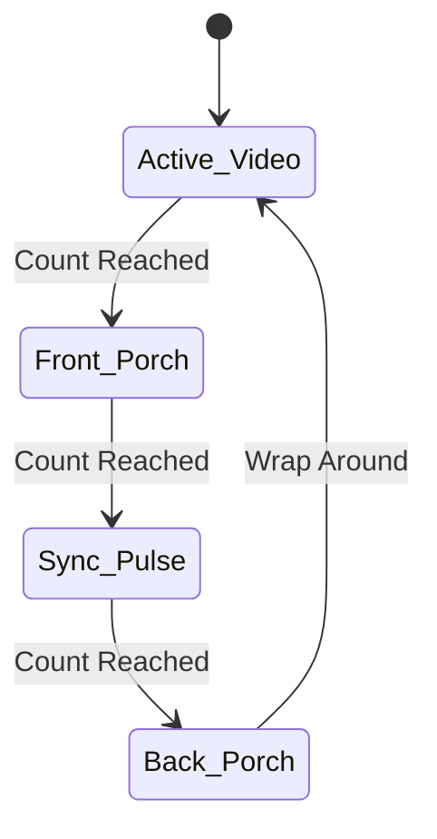

# FPGA VGA Image Viewer

A hardware-level VGA controller designed in Verilog to display a scaled 320x240 image on a 640x480 @ 60Hz display using an Intel Cyclone V FPGA (DE10-Standard). 

## Architecture Overview
The system reads 24-bit RGB pixel data from internal M10K Block RAM via an instantiated 1-Port ROM. To fit the image within the internal FPGA memory limits, the top module scales a 320x240 image by mathematically dropping the LSB of the horizontal and vertical counters (`pixel_x[9:1]`, `pixel_y[9:1]`), creating a 2x2 pixel duplication effect that perfectly fills the 640x480 active video region.

### Hardware Components
* **PLL:** Converts the 50 MHz board clock to the 25.175 MHz pixel clock required for standard 640x480 VGA timing.
* **VGA Controller:** Generates precise `h_sync` and `v_sync` pulses, alongside `pixel_x` and `pixel_y` coordinates and a `video_on` blanking protection flag.
* **Image ROM:** A 76,800-word deep, 24-bit wide single-port ROM containing the `.mif` image data.

## VGA Timing State Machines
The controller utilizes two synchronized finite state machines (FSM) to manage the Active Video, Front Porch, Sync Pulse, and Back Porch regions. 



## The 320x240 Memory Constraint: Why We Scaled Down
To display an image, the FPGA must store the pixel data in its internal Block RAM (M10K blocks). A standard 640x480 resolution image at 24-bit color depth (8 bits each for Red, Green, and Blue) requires a massive amount of memory:

* **Full Image Memory:** 640 × 480 × 24 bits = **7,372,800 bits (~7.37 Megabits)**

The Cyclone V FPGA on the DE10-Standard board contains approximately **5.5 Megabits** of total internal M10K memory. Because the uncompressed image is larger than the physical memory available on the chip, we scaled the image down to exactly half its dimensions:

* **Scaled Image Memory:** 320 × 240 × 24 bits = **1,843,200 bits (~1.84 Megabits)**

This fits comfortably inside the FPGA. To make this smaller image fill the full 640x480 screen, the RTL implements **pixel doubling** by mathematically dropping the Least Significant Bit (LSB) of the current screen coordinates (`pixel_x[9:1]` and `pixel_y[9:1]`). This effectively divides the display counters by 2, causing the hardware to hold every pixel for two clock cycles horizontally and two lines vertically, creating a perfect 2x2 stretch without losing synchronization.

## Repository Setup & Compilation

### 1. Generate the Image Data
You must convert a standard image into a Memory Initialization File (`.mif`) before compiling. Use the provided Python script:
```bash
pip install Pillow
python convert_image.py
